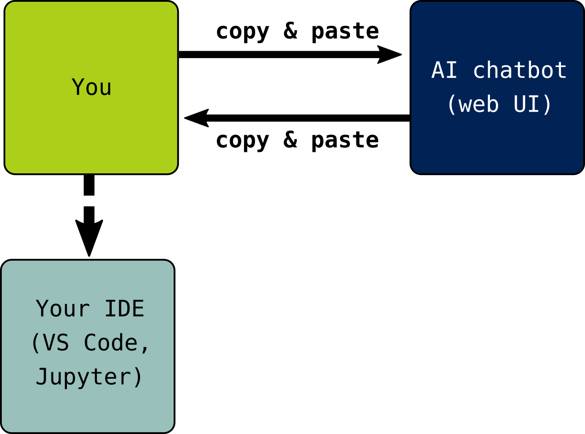
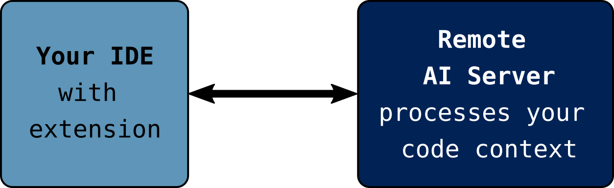
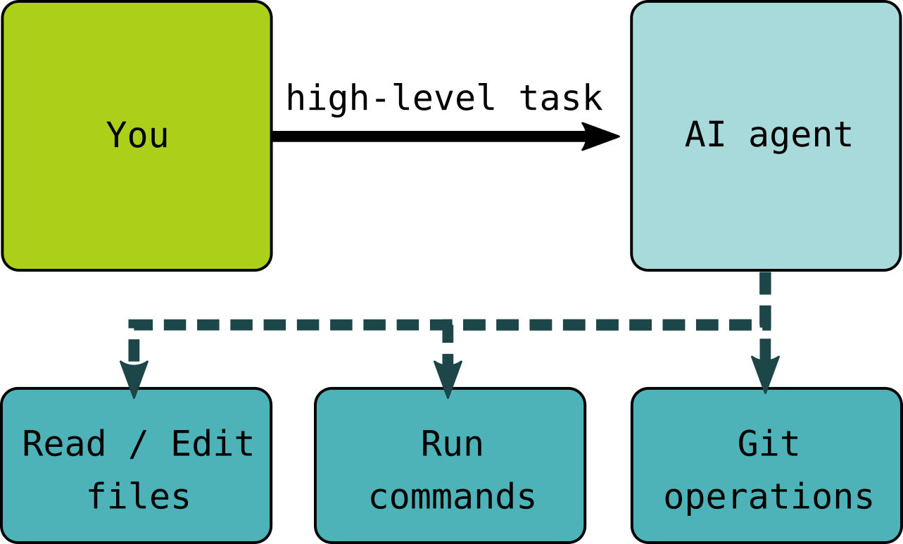

## Questions & Objectives {.smaller}

::: {.callout-tip appearance="simple"}
### Questions

- What does the current landscape of genAI tools for coding look like?
- What AI tools are researchers and programming novices typically using?
:::

::: {.callout-note appearance="simple"}
### Objectives

- Summarise the different modes of interaction that currently exist for AI-assisted coding.
- Identify which of these modes are most likely to be used by members of the target audience for our workshops.
:::

::: {.attribution}
Some of the content in this episode is adapted from [Code Refinery's *Responsible Use of Generative AI in Assisted Coding*](https://coderefinery.github.io/coding-with-ai/introduction/) ([licensed CC BY 4.0](https://github.com/coderefinery/coding-with-ai/blob/main/LICENSE)).
:::

## Three Modes of AI-Assisted Coding

AI coding assistants come in many forms. Here are the major categories:

::: {.columns .small}
::: {.column width="33%"}
### Chatbots
Type or paste a prompt into a web/app interface; paste the code back into your own environment.
:::
::: {.column width="33%"}
### IDE-Integrated
The model sees your project files through an editor extension and suggests completions.
:::
::: {.column width="33%"}
### Agentic
The model runs commands, reads and edits files, and acts on your behalf.
:::
:::

## Chatbots

{width="52%" fig-alt="In this scenario, you type or copy/paste prompts into a chatbot interface (usually a web UI) and copy/paste the code you get back as a response into an IDE or another environment where it can be executed."}

::: {.small}
The **most widely-used** mode of interaction with genAI models. Most users interact with a chatbot via an app or web interface.
:::

## IDE-integrated Assistants

{width="78%" fig-alt="In this scenario, you work with a GenAI model through an extension or integration to an IDE. The model has access to the project files and processes this information into its context."}

::: {.smaller}
The model processes the files in the project you are working on and includes that information in its **context window** — roughly speaking, the model's working memory of information relevant to whatever response it will produce next.

Through the IDE, the model can suggest auto-completion (e.g. of a function body based on the docstring) and provides a chat interface for prompts. There are genAI extensions for most IDEs, as well as some "AI first" IDEs that boast more extensive integration.
:::

## Agentic Coding Tools

{width="50%" fig-alt="In this scenario, you provide a high-level description of a task that you want an AI agent to perform. The agent is able to execute software on the system, read and edit files, perform version control operations, etc."}

::: {.smaller}
The agent may read and write files, run commands, process feedback, potentially run new commands based on the results, and so on — until it gets stuck, is interrupted, or determines the task is complete.

**This is the most powerful mode of interaction, and the mode with the highest risk**, since the model can act quickly in ways that affect the system it is running on.
:::

## A Spectrum, Not Three Boxes {.smaller}

::: {.callout-note}
In reality, AI coding tools exist on a **spectrum with many hybrids**: PR-native agents, review bots, orchestration tools, local-first options, and more.

The boundary between chatbots and agents is blurred too. For example, browser-based chat interfaces connect to models with the ability to run tools in a cloud instance, search the internet, attach files, etc.
:::

See Code Refinery's resource, [*The Full Spectrum of AI Coding Tools*](https://coderefinery.github.io/coding-with-ai/appendix-spectrum/), for an extended taxonomy.

## What Are Learners Using? {.smaller}

The technological landscape is evolving quickly, with new tools and models appearing very frequently. In this context, it can be difficult to access hard data about what people are using and how.

::: {.takeaway}
In survey results published in April 2026, O'Brien and colleagues reported that the **vast majority of scientists** who reported using genAI to assist programming in their research were using a **chatbot** (mostly ChatGPT) as their primary tool.

::: {.smaller}
[(O'Brien et al 2026)](09-references.html) — 80% of 868 scientists surveyed use genAI tools in their programming; 77.5% of those use general-purpose tools like ChatGPT over specialised coding tools.
:::
:::

Experience reports shared by Carpentries Instructors and other educators also suggest that chatbots are the primary mode of engagement for learners.

While some learners may be trying out more specialised tools (e.g. Cursor and Claude Code), **the focus of this bonus module is on learners' use of chatbots in workshops**.

## Key Points

::: {.callout-tip appearance="simple"}
- People are using **chatbots, IDE integrations, and coding agents** to assist with software development and data analysis.
- Data is scarce and the landscape is constantly shifting, but at the moment it seems that **chatbots are the most common mode of engagement** with genAI for our target learners.
:::
