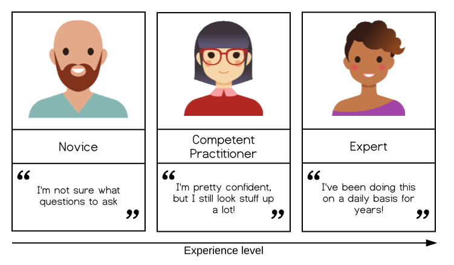

## Questions & Objectives {.smaller}

::: {.callout-tip appearance="simple"}
### Questions

- How does a user's expertise affect their use of genAI tools?
- What can Instructors do to discourage learners from relying on chatbots to solve exercises during a workshop?
:::

::: {.callout-note appearance="simple"}
### Objectives

- Explore the influence of expertise on the use of genAI tools and the quality and interpretation of their output.
- Recognise the importance of a user's mental model in guiding and taking responsibility for output generated by an AI model.
:::

## Experts Are Not Novices {.smaller}

Many (research) software engineers have concluded that genAI tools are now sufficiently effective and reliable for code generation that they no longer need to do much programming by hand. These experts report that they have found ways of working with genAI tools that **leverage their expertise**.

::: {.callout-warning appearance="simple"}
Despite widely publicised claims that anybody can now code using genAI, **novices are unlikely to achieve equivalently good results**.

[Novices lack a mental model](https://carpentries.github.io/instructor-training/02-practice-learning.html#the-acquisition-of-skill) for conceptualising and articulating what they want to achieve, how it could be achieved, how it could go wrong, etc.
:::

## The Model of Skill Acquisition

{width="74%" fig-alt="Three people, labelled from left to right as 'Novice', 'Competent Practitioner', and 'Expert'. Underneath, an arrow labelled 'Experience level' points from left to right. The 'Novice' is quoted, 'I am not sure what questions to ask.' The Competent Practitioner is quoted, 'I am pretty confident, but I still look stuff up a lot!' The Expert is quoted 'I have been doing this on a daily basis for years!'"}

::: {.attribution}
The simplified model of skill acquisition presented in Instructor Training.
:::

## They Don't Know What They Don't Know {.smaller}

Of course, novices may not *expect* to achieve the same results as an expert. They may be motivated to use genAI tools because they feel it will help them produce **better results, faster** than they could on their own.

Conceptual understanding and knowledge of relevant terminology are essential for learners to articulate what they want to achieve, and to process the responses they receive. This is comparable to how the use of relevant terminology in search terms is likely to produce more relevant internet search results.

::: {.takeaway}
But the model of skill acquisition tells us the barrier is more than a limited vocabulary: one characteristic of a novice is that **they do not know what they do not know**. A novice cannot articulate what they want to do, because they may not yet know what it is.
:::

To keep improving the results they receive, and take responsibility for AI-generated outputs, **learners must build their own expertise**.

## Five Interaction Modes {.smaller}

[Richards et al 2026](09-references.html) identified five interaction modes among programmers using genAI tools:

| Mode | Description |
|:--|:--|
| **Navigator** | Uses genAI to find their way around the code base. |
| **Autopilot** | Asks genAI to solve their problems completely automatically. |
| **Deputy** | Uses genAI incrementally to advance collaboratively toward a solution. |
| **Technician** | Similar to Deputy, but uses smaller, more granular changes that are carefully reviewed. |
| **Scholar** | Uses genAI to explain concepts or provide information support. |

: {tbl-colwidths="[22,78]"}

## Exercise: Copying/Pasting Exercises {.smaller}

One challenge that Instructors now report encountering in workshops is that some learners will **copy and paste the text of an exercise into a chatbot**, then copy and paste the code it produces back out again, to "solve" the exercise.

::: {.callout-important appearance="simple"}
- What are some ways that you might **notice** this is happening in a workshop?
- Suggest **one strategy** that an Instructor could employ to discourage or prevent learners from doing this.
:::

::: {.notes}
Challenge. Collect answers from the group before revealing the next two slides.
:::

## Solution: How You Might Notice {.smaller}

Indications of an AI-generated solution include:

- Use of functions, syntax, language features, etc. that **have not yet been introduced** in the workshop.
- **Complex** code (more on this in the next episode).
- An **abundance of comments** explaining the lines of code.
- **Inability for the learner to explain** how the solution works.

## Solution: Strategies from Trainers {.smaller}

- Explain the **importance of exercises for learning** (transfer from working to long-term memory, metacognition).
- **Celebrate** the successful, manual completion of an exercise.
- Ask learners to **explain their solutions**.
- Follow up an exercise by asking learners to make **small modifications** to change the behaviour of their solutions.

::: {.attribution}
Note to Trainers: if you receive more suggestions from participants while delivering this bonus module, please [open a pull request](https://github.com/carpentries/instructor-training-genai) to add them to the curriculum.
:::

## Exercise: Identifying Modes {.smaller}

Skim the Results section of [Richards et al 2026](https://arxiv.org/abs/2606.19216) and identify the **pros and cons of each of the five interaction modes** for:

- **Novices**,
- **Competent Practitioners**, and
- **Experts** *in their own domains*

— who are all **novice users of genAI**.

## Solution: Identifying Modes {.smaller}

1. There is an emerging consensus that **Autopilot** mode has the most drawbacks, both in the short term (generated solutions may be plausibly wrong) and long term (users will learn the least).
2. **Scholar** and **Navigator** modes may have the best benefit-to-drawback ratio, as they increase the user's knowledge rather than supplanting it.
3. **Technician** mode is often a step toward **Deputy**, and that progression should be encouraged.

::: {.callout-warning appearance="simple"}
Keep in mind that all of this is provisional and subject to change.
:::

## Key Points

::: {.callout-tip appearance="simple"}
- A user needs a **working mental model of a domain** in order to articulate what they want to achieve and to evaluate the results they get from an AI tool.
- Instructors should encourage learners to **develop their own expertise** and avoid giving up their agency to genAI tools.
:::
